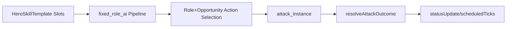

# Hero Skill Template (v1)

Status: Draft
Version: v0.1
Owner: Design
Last Updated: 2026-03-20
Scope: Defines v1 hero unified skill-slot template (Basic/Small/Ultimate/Passive) and their integration contract with combat-core via `attack_instance` and `skill_enhancement_level`.
Related: docs/design/feature-systems/hero-squad-baseline.md; docs/design/feature-systems/skill-enhancement-logic.md; docs/design/feature-systems/role-tags-fixed-role-ai-contract.md; docs/design/combat-rules/combat-attributes-resolution.md; docs/design/combat-rules/combat-core-l3-squad-autonomy.md

Notes:
- v1 enforces a fixed number of skill slots per hero to avoid per-hero exceptions in autonomous combat planning.
- This doc specifies mechanics/semantics only; numeric tuning belongs in `values/*.csv` of the relevant topic.

## 1. Why a Unified Template
Heroes are the key interaction unit in v1 combat. In this project, autonomous combat behavior is driven by `fixed_role_ai`, while combat resolution is driven by `attack_instance` semantics (see `combat-attributes-resolution.md`). Therefore, each hero must provide a consistent skill surface that:
1. Can be selected deterministically in the autonomy pipeline (survival check -> role action selection -> opportunity action check).
2. Can be resolved consistently by combat-core into stable outcomes (`hitOutcome`, `crit`, `instantDamage`, `statusUpdate`, `scheduledTicks`).

## 2. Slot Count (Fixed Invariant)
Each hero must contain exactly:
- `BasicAttack`: 1 slot
- `SmallSkill`: 2 slots (SmallSkillA + SmallSkillB)
- `UltimateSkill`: 1 slot
- `PassiveSkill`: 3 slots (Passive1/2/3)

If a specific hero fantasy “lacks an ultimate”, the `UltimateSkill` slot must still exist, but may be configured as `disabled` (eligibility is always false). This preserves template invariants and keeps AI planning uniform.

## 3. Vocabulary and Stable Slot IDs
The template uses stable slot IDs so hero configs are consistent across systems:
- `basic_attack`
- `small_skill_a`
- `small_skill_b`
- `ultimate_skill`
- `passive_1_static`
- `passive_2_on_hit_or_status`
- `passive_3_signature_or_enhancement`

## 4. Integration Contract with combat-core
### 4.1 Autonomy Pipeline Responsibilities
Combat-core autonomy is governed by:
1. Survival check
2. Role action selection
3. Opportunity action check

Slot usage constraints for v1:
- When a hero is `stunned`, combat-core must skip role action selection and opportunity action selection for that hero; only stun behavior/animation plays (see `combat-attributes-resolution.md` stun integration section).
- `BasicAttack` is the always-eligible fallback within the role action selection stage (when not stunned).
- `SmallSkillA` and `SmallSkillB` are eligible as role-action candidates (their selection priority is determined by the hero role family and tactical context).
- `UltimateSkill` is eligible only through the opportunity action check (i.e., it must express its own opportunity/qualification rules rather than being freely fired).

### 4.2 Resolution Semantics (attack_instance Alignment)
All active slots (`basic_attack`, `small_skill_*`, `ultimate_skill`) must be expressible as one or more `attack_instance` records that combat-core can resolve via:
`resolveAttackOutcome(attacker, target, attack_instance)`

From `combat-attributes-resolution.md`, resolution consumes an attack instance that results in (conceptually):
- `hitOutcome: miss|glance|deflect|hit`
- `crit: bool`
- `hitDamageMultiplier: number`
- `instantDamage: number`
- `statusUpdate: { statusToken, addedStacks, newStackCount, durationRemaining }`
- `scheduledTicks` for DOT/CC tick events.

Stun CC semantics are handled by resolution:
- Stun is evaluated only when `hitOutcome != miss` and the originating `attack_instance` includes `stunChance` and `stunDurationBaseSec` (see stun eligibility and stun chance roll rules).

Therefore, the template contract is:
- Active skill designers must ensure their skills produce `attack_instance` content consistent with these resolution semantics.

## 5. Slot Responsibilities (Mechanics/Behavior, not Numbers)
### 5.1 BasicAttack (`basic_attack`, 1 slot)
Primary responsibilities:
1. Provide a stable damage/pressure rhythm for autonomous combat.
2. Serve as the main repeated source of “eligible attack instances” for hit quality / crit / elemental status application.

Selection & constraints:
- Must remain usable in normal role-action resolution (when not stunned).
- Should avoid becoming the sole identity-defining mechanic of a hero; uniqueness must mainly come from small skills, passives, and enhancement coupling.

Allowed effects (must be representable by attack instances):
- Direct damage via `baseDamage` -> `instantDamage`.
- Elemental damage application (`damageType` -> element status via resolution).
- Optional stun (only if represented as `stunChance` + `stunDurationBaseSec` on `attack_instance`).

### 5.2 SmallSkill A (`small_skill_a`, 1 slot of 2)
Primary responsibilities:
1. Represent the hero’s “main output behavior” (role-family closer to DPS/frontliner).
2. Distinguish the hero’s core playstyle through a consistent action pattern (targeting rule, area/arc meaning, damage/element profile, or status focus).

Selection & constraints:
- Should have higher frequency availability than `UltimateSkill`.
- Must clearly express its action category so autopilot does not oscillate between equivalent behaviors.

Effect taxonomy (choose at least one):
- Direct DPS/element status pressure
- Burst-like damage within readability constraints
- Primary CC application (if the hero’s identity is control-oriented)

### 5.3 SmallSkill B (`small_skill_b`, 1 slot of 2)
Primary responsibilities:
1. Represent “coverage/utility behavior” aligned with support/control families (sustain timing, defensive utility, disruption, or reactive status coverage).
2. Provide an alternative action category to keep autonomous decisions readable and non-redundant.

Selection & constraints:
- Must be meaningfully different from `SmallSkillA` in action category.
- Should include at least one of:
  - defensive/mitigation-related utility (via stat channels or effect modifiers),
  - crowd pressure reduction via interruption/disruption semantics,
  - status coverage that diversifies elemental/CC interactions.

Allowed effects:
- Active effects via attack instances (damage, status application, optional stun).
- Passive-driven modifications to how the above are computed (see passives).

### 5.4 UltimateSkill (`ultimate_skill`, 1 slot)
Primary responsibilities:
1. Be the hero’s most impactful, clearly readable event tied to opportunity windows.
2. Create moment-to-moment “learnable spikes” in boss/elite pacing without breaking the global readability policy.

Activation rules:
- Ultimate eligibility must be expressed as qualification rules consumed by opportunity action check.
- It should not be used as a default role-action spam; otherwise it collapses readability and build planning.

Allowed effects:
- High-impact damage and/or decisive CC application via attack instances.
- Multi-target patterns are allowed as long as they remain resolvable through the same `attack_instance` semantics.

### 5.5 Passive Skills (`passive_1_static`, `passive_2_on_hit_or_status`, `passive_3_signature_or_enhancement`, 3 slots)
Passive skills are mandatory and must exist for every hero, but their content can vary per hero identity.

#### Passive1 Static (`passive_1_static`)
Role:
- Long-term constant modifiers that affect stat channels and/or how active skills compute their outputs.

Typical outputs (examples):
- Multipliers to relevant stat channels (accuracy/crit/element power).
- Baseline role-family behavior modifiers.

Template contract:
- Must be deterministic and compatible with `fixed_role_ai` autonomy (no tactical profile switching).

#### Passive2 OnHitOrStatus (`passive_2_on_hit_or_status`)
Role:
- Triggered behavior on combat events such as:
  - eligible hit instances,
  - elemental status application/update,
  - CC/freeze/shock-related interactions,
  - stun application (if represented as a skill effect).

Template contract:
- Its triggers must be expressible without introducing new autonomy stages.
- Passive2 may:
  - modify outgoing attack instance content (e.g., add extra status potency),
  - modify subsequent behavior through deterministic stat/effect channels.

#### Passive3 Signature Or Enhancement (`passive_3_signature_or_enhancement`)
Role:
- The explicit coupling point between the hero’s enhancement progression and readable mechanic changes.

Hard requirement from `skill-enhancement-logic.md`:
- Each increment of `skill_enhancement_level` must change skill behavior/mechanics in a readable way, not only “bigger numbers”.

Template contract:
- Passive3 must provide an ordered “mechanic ladder” across `skill_enhancement_level` where each enhancement level (or each contiguous level block) unlocks at least one new or modified mechanic.
- Allowed mechanic changes must remain consistent with:
  - role-driven autonomy pipeline order,
  - resolution semantics via `attack_instance`.

## 6. Enhancement Coupling (How `skill_enhancement_level` Impacts the Template)
The template defines *where* `skill_enhancement_level` is allowed to change mechanics:
- Passive3 is the primary enhancement coupling slot.
- Active slots may also change behavior deterministically with enhancement level, but only when that change is represented as:
  - additional/modified effects in the produced `attack_instance`s,
  - or deterministic changes in triggered/passive modifier channels.

This ensures enhancement remains predictable for build planning while keeping v1 autonomy constraints stable.

## 7. Mechanic Readability Guardrails
To keep autonomy readable under `move_only` and `fixed_role_ai`:
- Active slots must have distinct action categories (damage pattern, element type focus, or CC/utility pattern) between `SmallSkillA` vs `SmallSkillB`.
- Ultimate must be gated by opportunity/qualification so it appears as a “moment spike” rather than constant spam.
- Stun overrides autonomy for the stunned target; therefore all CC/stun-producing skills must be consistent with the resolution stun semantics.

## 8. Quick Reference Summary
- Hero kit = `basic_attack` (1) + `small_skill_a/b` (2) + `ultimate_skill` (1) + `passive_1/2/3` (3).
- Autonomy: role action picks Basic/Small; opportunity picks Ultimate.
- Resolution: all active skills produce `attack_instance`s that combat-core resolves into stable outcomes.

## 9. Diagram (Discussion Aid)

